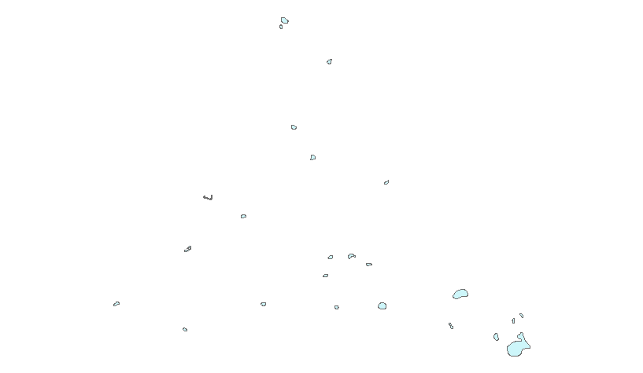

# LAB 1: GEOPROCESSING IN ARCGIS
Author: Claire Morehouse

Due: 23 OCT 2020

## Lab Description
This repository contains two scripts that each execute different geoprocesssing mechanisms in ArcMap using Python 3. The flooding script was creating by converting a Model built in ArcMap to Python Script. The script takes the shapefiles of floodzones and basin, and clips the floodzones using basin as a "cookie-cutter", and then from that clipped shaped, selects Special Flood Hazard Areas. The final output is a shapefile of the Special Flood Hazard Areas in the clipped floodzone areas. The my_clip script as written in Python, and creates a workspace in the Lab 1 Geoprocessing folder, and then clips the lake shapefile using basins as the "cookie-cutter". The final output is lake_myclip, which is a clipped version of lakes. 

Below is an image of the clipped lake shapefile that is the final output of my_clip. 

